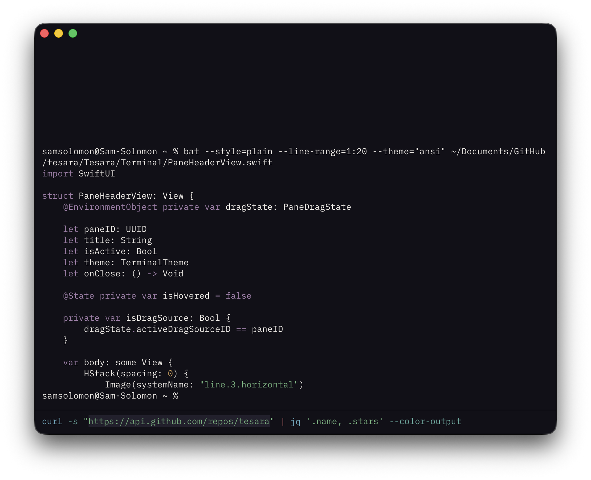

# Tesara

A modern, minimal terminal emulator for the agentic age.

[MacOS Download](https://github.com/samsolomon/tesara/releases/latest/download/Tesara.zip)

## Features

Tesara is a native macOS terminal that prioritizes clarity, speed, and restraint. It pairs a SwiftUI/AppKit shell with Ghostty's GPU-accelerated renderer to deliver fast, accurate terminal output inside a calm, intentional interface.

- **Native macOS experience** — proper windowing, tabs, and keyboard shortcuts that feel at home on the platform
- **Sidebar tabs** — an optional vertical tab bar for quick navigation when you have many sessions open
- **GPU-accelerated rendering** — powered by Ghostty's Metal-backed `libghostty` for fast, accurate terminal output
- **Agent notifications** — tab badges and macOS notifications when a background process needs attention
- **Split panes** — divide your workspace without leaving the window
- **Inline editor** — native text editing surfaces within your terminal
- **Command history** — persistent, searchable history across sessions
- **Themes and settings** — configurable via `~/.config/tesara/config` with live reload

## Install

Download the latest release from the [releases page](https://github.com/samsolomon/tesara/releases/latest).

1. Unzip `Tesara.zip`
2. Move `Tesara.app` to `/Applications`
3. Right-click the app and choose **Open** (required on first launch since the app is not yet notarized)

## Stack

- SwiftUI + AppKit
- Swift 5.10
- macOS 14+
- Zig-built `libghostty`
- GRDB
- Sparkle

## Building from source

Requirements:

- Xcode
- Zig `0.15.2`
- the `vendor/ghostty` submodule

Then open `Tesara.xcodeproj` and run the `Tesara` scheme.

The build links against a local `libghostty.a` and applies `vendor/patches/ghostty-build.patch` before building the vendored Ghostty library.
