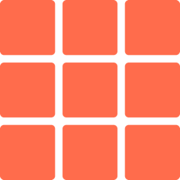

# Tesara

A modern, minimal terminal emulator for macOS.

Tesara is a native macOS terminal that prioritizes clarity, speed, and restraint. It pairs a SwiftUI/AppKit shell with [Ghostty](https://ghostty.org)'s GPU-accelerated renderer to deliver fast, accurate terminal output inside a calm, intentional interface.

## Features

- **Native macOS experience** — proper windowing, tabs, and keyboard shortcuts that feel at home on the platform
- **GPU-accelerated rendering** — powered by Ghostty's Metal-backed `libghostty` for fast, accurate terminal output
- **Split panes** — divide your workspace without leaving the window
- **Inline editor** — native text editing surfaces alongside your terminal
- **Command history** — persistent, searchable history across sessions
- **Themes and settings** — configurable via `~/.config/tesara/config` with live reload

## Stack

- SwiftUI + AppKit
- Swift 5.10
- macOS 14+
- Zig-built `libghostty`
- GRDB
- Sparkle

## Building from source

Requirements:

- Xcode
- Zig `0.15.2`
- the `vendor/ghostty` submodule

Then open `Tesara.xcodeproj` and run the `Tesara` scheme.

The build links against a local `libghostty.a` and applies `vendor/patches/ghostty-build.patch` before building the vendored Ghostty library.
